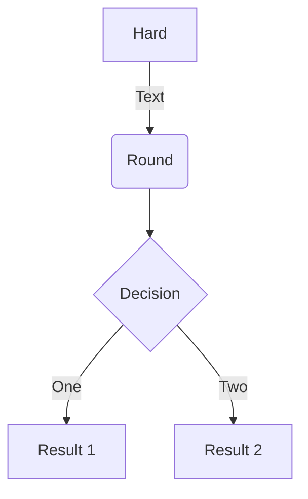

# Guide to Configuring and Creating Markdown Posts

This guide summarizes how to configure and create markdown posts for a Hugo-based site. It covers folder structure, front matter, and common content features.

## Folder Structure

Blog posts live under `content/english/blog/`:

```
content/english/blog/
├── _index.md
├── model-context-protocol.md
├── extract-important-words-weirdness.md
├── unigram-frecuency-corpus.md
└── guides.md
```

Supporting data files for this guide are available at `/blog/guides/`:

- [`results.csv`](/blog/guides/results.csv)
- [`line-chart.json`](/blog/guides/line-chart.json)

## Post Front Matter

Example front matter for a Hugoplate post:

```markdown
---
title: "Your Post Title"
description: "A short summary of your post."
date: 2025-06-07T00:00:00Z
image: "/images/image-placeholder.png"
categories: ["NLP"]
author: "Anderson Morillo"
tags: ["Tag1", "Tag2"]
draft: false
---
```

### Content Features

- **Headings, lists, links, images**: Standard Markdown
- **Code blocks**: Syntax highlighting for many languages
- **Math**: Inline `$...$` and block `$$...$$` LaTeX (when enabled)
- **Diagrams**: Mermaid fenced code blocks
- **Media**: Place images under `assets/images/` or `static/` and reference them by path

### Example: Mermaid Diagram



### Example: Math

Inline math: `$\nabla F(\mathbf{x}_{n})$`

Block math:

$$
\gamma_{n} = \frac{ \left | \left (\mathbf x_{n} - \mathbf x_{n-1} \right )^T \left [\nabla F (\mathbf x_{n}) - \nabla F (\mathbf x_{n-1}) \right ] \right |}{\left \|\nabla F(\mathbf{x}_{n}) - \nabla F(\mathbf{x}_{n-1}) \right \|^2}
$$

## Tips
- Keep related media and data next to the post or under `static/`
- Use front matter for title, description, tags, and categories
- Prefer portable Markdown over theme-specific shortcodes when possible

## References
- [Hugo Documentation](https://gohugo.io/documentation/)
- [Hugoplate](https://github.com/zeon-studio/hugoplate)
