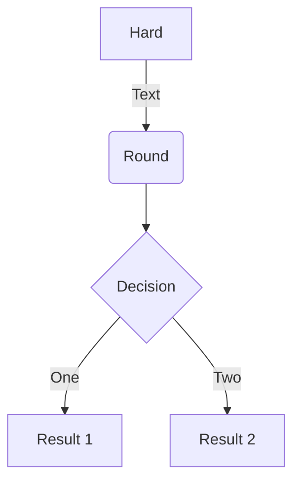

# Guide to Configuring and Creating Markdown Posts in `/post`

This guide summarizes all the ways you can configure and create markdown files in the `/post` section of your Hugo Blox site. It covers folder structure, section-level configuration, and all the features you can use in your posts.

## Folder Structure

Your `/post` directory is organized as follows:

```
content/post/
├── _index.md                # Section configuration
├── extract-important-words-weirdness/
│   └── index.md             # Example post
├── unigram-frecuency-corpus/
│   └── index.md             # Example post
├── teach-courses/
│   ├── index.md             # Example post
│   ├── featured.jpg         # Media file
│   └── ambient-piano.mp3    # Audio file
├── second-brain/
│   ├── index.md             # Example post
│   └── featured.jpg         # Media file
├── project-management/
│   ├── index.md             # Example post
│   └── featured.jpg         # Media file
├── get-started/
│   ├── index.md             # Example post
│   └── featured.jpg         # Media file
└── data-visualization/
    ├── index.md             # Example post
    ├── line-chart.json      # Data for chart
    ├── results.csv          # Data for table
    └── featured.jpg         # Media file
```

## Section-level Configuration: `_index.md`

The `_index.md` file configures the section. Example:

```markdown
---
title: Posts
view: article-grid
---
```
- `title`: The section title
- `view`: Layout style (e.g., `article-grid`)

## Post Structure and Features

Each post is a folder (page bundle) with an `index.md` file and optional media/data files. Example front matter:

```markdown
---
title: "Your Post Title"
summary: "A short summary of your post."
date: 2025-06-07
authors:
  - admin
tags:
  - Tag1
  - Tag2
image:
  caption: 'Image credit: [**Unsplash**](https://unsplash.com)'
math: true  # Enable LaTeX math (optional)
---
```

### Content Features

- **Headings, lists, links, images**: Standard Markdown
- **Shortcodes**: Add dynamic content
  - YouTube: ``
  - Audio: ``
  - Video: ``
  - Table: ``
  - Chart: ``
  - Mermaid diagrams: Use fenced code blocks with `mermaid`
  - Spoiler: `Hidden content`
- **Code blocks**: Syntax highlighting for many languages
- **Math**: Inline `$...$` and block `$$...$$` LaTeX
- **Media**: Place images, audio, or video in the post folder and reference them

### Example: Data Visualization Post

```markdown
---
title: "📈 Communicate your results effectively with the best data visualizations"
summary: "Use popular tools such as Plotly, Mermaid, and data frames."
date: 2023-10-25
authors:
  - admin
tags:
  - Hugo
  - Hugo Blox
  - Markdown
image:
  caption: 'Image credit: [**Unsplash**](https://unsplash.com)'
---

## Charts



## Diagrams



## Data Frames


```

### Example: Embedding Media and Math

```markdown
---
title: "👩🏼‍🏫 Teach academic courses"
math: true
---

## Video



## Audio



## Math

Inline math: `$\nabla F(\mathbf{x}_{n})$` renders as $\nabla F(\mathbf{x}_{n})$

Block math:

$$
\gamma_{n} = \frac{ \left | \left (\mathbf x_{n} - \mathbf x_{n-1} \right )^T \left [\nabla F (\mathbf x_{n}) - \nabla F (\mathbf x_{n-1}) \right ] \right |}{\left \|\nabla F(\mathbf{x}_{n}) - \nabla F(\mathbf{x}_{n-1}) \right \|^2}
$$
```

## Tips
- Use folders for each post to keep related media and data together
- Use front matter to enable features (math, tags, etc.)
- Use shortcodes for dynamic and rich content

## References
- [Hugo Blox Documentation](https://docs.hugoblox.com/)
- [Hugo Shortcodes](https://gohugo.io/content-management/shortcodes/) 